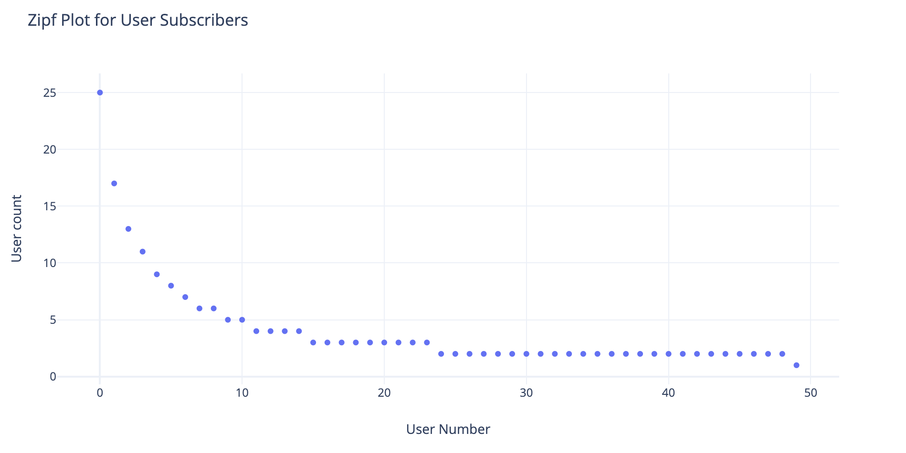
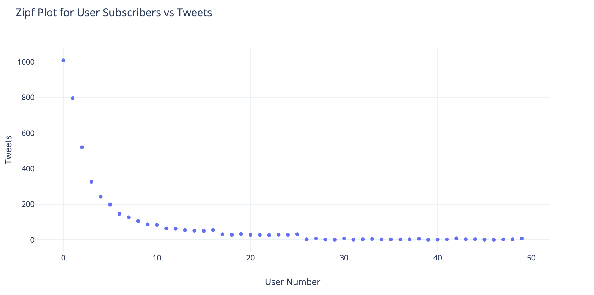
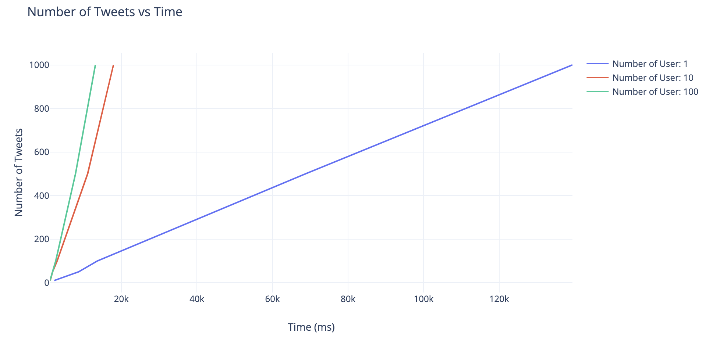
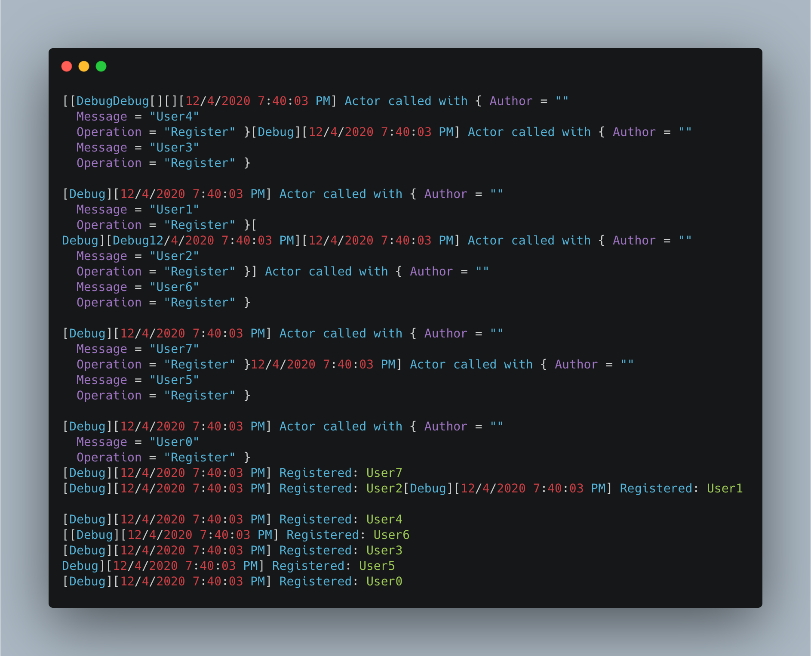
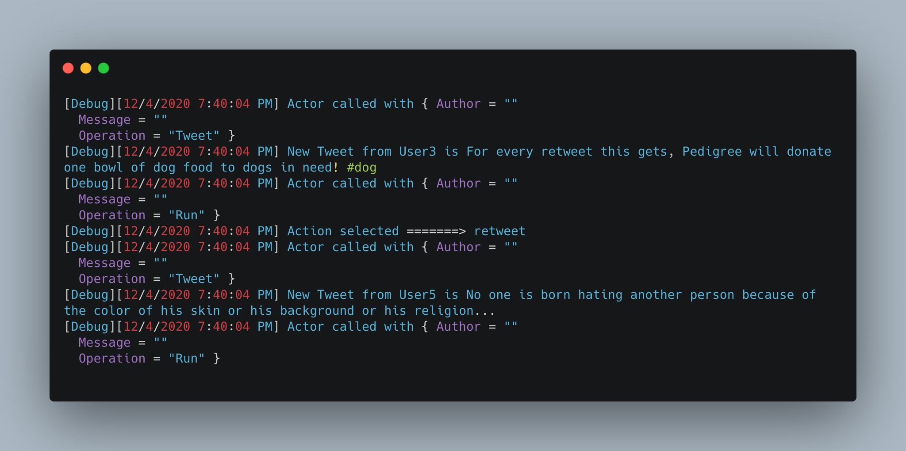
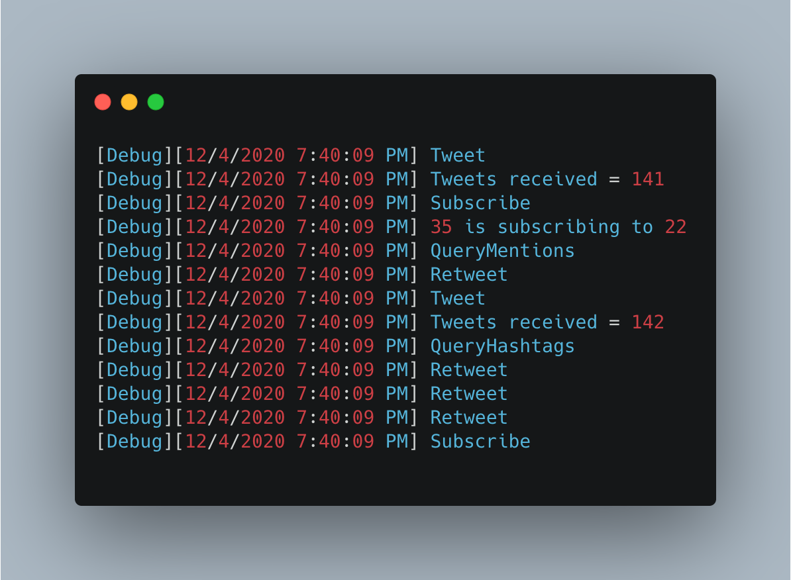
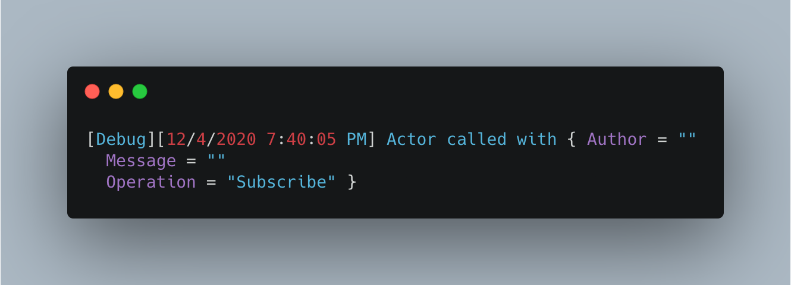
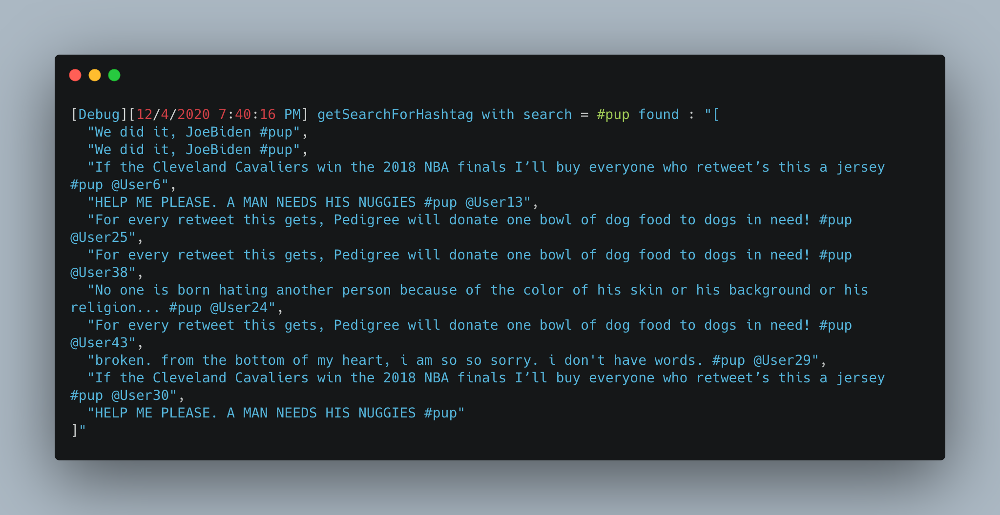
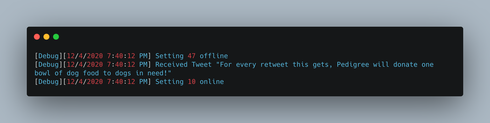

<h1 align="center"> Twitter Simulator </h1>  

## Table of Contents

- [Table of Contents](#table-of-contents)
- [Build Process](#build-process)
- [What is Working](#what-is-working)
- [Implementation](#implementation)
- [Zipf](#zipf)
- [Performance](#performance)
- [Console Output](#console-output)
  - [Register Account (Client)](#register-account-client)
  - [Tweet (Client)](#tweet-client)
  - [Subscribe (Server)](#subscribe-server)
  - [Subscribe (Client)](#subscribe-client)
  - [Query by Hashtag (Server)](#query-by-hashtag-server)
  - [Online/Offline Simulation (Server)](#onlineoffline-simulation-server)

## Build Process

- Git Clone or Download the project.
- `dotnet fsi --langversion:preview TwitterEngine.fsx numNodes numTweets` to run Twitter Engine script where `numNodes` is the number of users you want to run twitter engine. `numTweets` is the number of tweets that needs to simulate. The same values must be passed to client.
- And then run `dotnet fsi --langversion:preview Main.fsx numNodes numTweets` to run User Engine script where `numNodes` is the number of users you want to run simulator/tester for. `numTweets` is the number of tweets that needs to simulate.
- `dotnet fsi --langversion:preview ZipfTwitterEngine.fsx numNodes numTweets` to run Twitter Engine script with zipf distribution where `numNodes` is the number of users you want to run twitter engine. `numTweets` is the number of tweets that needs to simulate. The same values must be passed to client.
- `dotnet fsi --langversion:preview ZipfMain.fsx numNodes numTweets` to run User Engine script with zipf distribution where `numNodes` is the number of users you want to run simulator/tester for. `numTweets` is the number of tweets that needs to simulate.

## What is Working

- Register account
- Send a tweet. Tweets can have hashtags (e.g. #COP5615isgreat) and mentions (@bestuser)
- Subscribe to user's tweets
- Re-tweets (so that your subscribers get an interesting tweet you got by other means)
- Allow querying tweets subscribed to, tweets with specific hashtags, tweets in which the user is mentioned (my mentions)
- If the user is connected, deliver the above types of tweets live (without querying)

## Implementation

Twitter Engine and User Engine accepts command line parameters as `numNodes` that denotes the amount of user that needs to be simulated along with `numTweets` that tells how many tweets need to be exchanged. There's no need for interaction with the user engine actor as it simulates the real-life scenario of tweeting, retweeting, subscribing, and searching for tweets.

A user needs to be a registered member in order to start tweeting. Whenever a tweet is made by an actor, it is sent to TwitterEngine. TwitterEngine forwards that tweet to the followers of the tweeted person. Every actor is made to simulate like a real person. At any given point in time, each actor can tweet, retweet, subscribe, or search for a tweet with hashtags or mentions.

The Boss actor is responsible for setting users at random, offline, or online (Simulates connection and disconnection of user). Whenever the user goes offline, all the tweets/retweets it receives are saved temporarily in offline meets and whenever it is online all the messages are delivered to the user. An Offline user cannot search or perform a subscription to another subscriber.
## Zipf

We have performed user distribution based zipf law. Below is a graph of each user with the user count. User 0 has 25 (50/2) subscribers. User 1 has 17 (50/3) subscribers and so on

We perform the simulation using the Zipf distribution amongst subscribers, we tried to measure the activity(tweets/retweets) of those users. We found that the more number of subscribers a user has, the more activity it generates in the system.

The interesting find is that the tweet activity despite being totally random among these users also followed a Zipf distribution (Sort of)

## Performance

We ran the simulation for a different number of users and the following are the results. It is clear that adding a more actor increase the performance of system i.e (there are more tweets processed per time) implying that the system is capable of handling a larger number of tweets.

## Console Output

Below are some of the output from console terminal. The client terminal sends are request to server. Client sends a request to object in json format. Server then intercepts this request and sends appropiate actions to client

### Register Account (Client)

### Tweet (Client)

### Subscribe (Server)

### Subscribe (Client)

### Query by Hashtag (Server)

### Online/Offline Simulation (Server)

